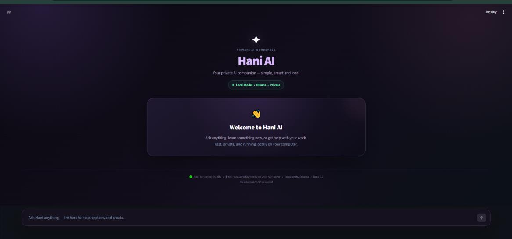
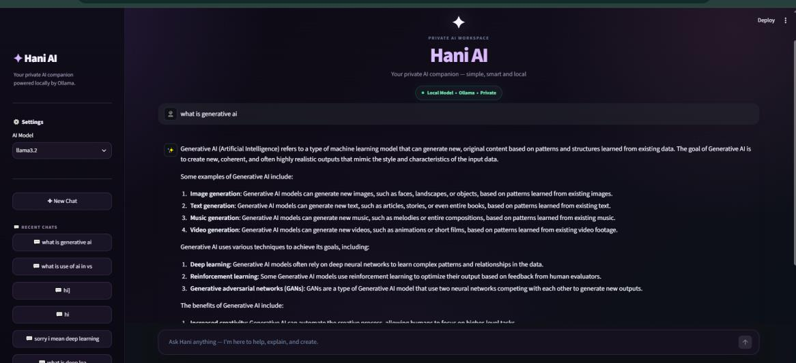

# ✨ Hani AI — Local LLM Chat Interface

A simple and interactive **Streamlit chat application** powered by a locally hosted **Llama 3.2** model through **Ollama**.

This project was developed as **Task 1 of my Generative AI Internship at Arch Technologies**.

## 🚀 Features

* 💬 Interactive chat interface
* 🧠 Local Llama 3.2 inference using Ollama
* 📚 Persistent conversation history
* ✒️ New Chat functionality
* 🗑️ Clear Current Chat functionality
* 🎨 Custom dark-purple UI
* ⚠️ Error handling for connection failures and timeouts

##  Technologies

**Python • Streamlit • Ollama • Llama 3.2 • Requests • JSON**

## 📂 Project Structure

```text
Hani-AI/
├── app.py
├── history.json
├── requirements.txt
└── README.md
```
## ⚙️ Setup
### 1. Install dependencies
```bash
pip install -r requirements.txt
```
### 2. Set up Llama 3.2 with Ollama

```bash
ollama pull llama3.2
```

### 3. Run the application

```bash
streamlit run app.py
```

The app will open at:

```text
http://localhost:8501
```

## 🔌 How It Works

```text
User → Streamlit → Ollama → Llama 3.2 → Response
                         ↓
                   history.json
```

The application sends user prompts to the locally running Ollama server and displays the generated responses through the Streamlit interface.

## 📸 Preview
### Hani AI Interface


### Chat Response


## 🎯 Internship Task

**Arch Technologies — Generative AI Internship**
**Task 1:** Streamlit Interface for Local LLM Inference

Built to gain hands-on experience with **local LLM inference, API integration, and Streamlit application development**.
---
**Developed by Sajal Sheraz** 
